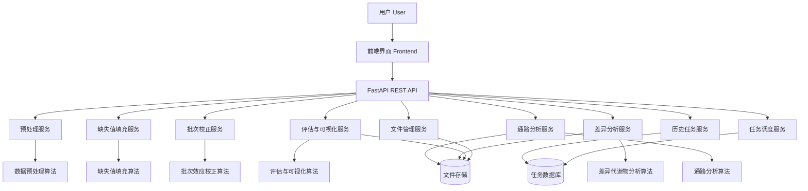
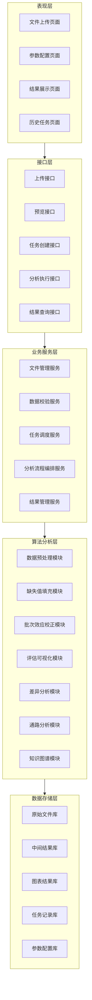

# 代谢组学数据处理系统架构（项目现状版）

> 面向代谢组学数据处理的 Web 系统架构与实现现状说明  
> 目标：作为毕业设计的“系统说明书 + 联调指南”，内容以 **当前仓库真实代码** 为准（不是规划稿）。

---

## 1. 项目目标

本系统是一个面向代谢组学数据处理的 Web 平台，核心能力包括：

- 上传代谢组学数据文件
- 数据格式校验与预览
- 基础预处理
- 缺失值填充
- 批次效应校正（本项目当前重点为 **baseline 批次校正**）
- 效果评估与可视化
- 任务记录与结果管理

### 1.1 当前项目进展（关键结论）

- **后端保持主链路不重写**：FastAPI + 现有数据处理逻辑保留不动；Jinja2 结果页继续作为保底展示版本。
- **新增独立前端**：在 `frontend/` 新建 Vue3 + Vite + TS 的“答辩演示型系统前端”，用于多页面展示、上传、参数配置、结果展示与历史任务。
- **严格术语**：
  - 当前 merged 结果页展示的是 **baseline 批次校正**（per-feature batch location-scale baseline）。
  - **strict ComBat 尚未实现**；页面与报告中必须明确标注“未实现/disabled”。

---

## 2. 推荐技术栈

## 2.1 后端
- Python 3.11+
- FastAPI
- Pydantic
- Uvicorn

## 2.2 算法与数据处理
- pandas
- numpy
- scipy
- statsmodels
- scikit-learn
- PyTorch

## 2.3 前端
### 当前采用方案（Route B）
- Vue3 + Vite
- TypeScript
- Vue Router
- Pinia
- Element Plus
- ECharts
- axios（HTTP 请求）

> 说明：仓库中仍保留后端的 Jinja2 页面作为保底演示；Vue3 前端为答辩展示层，不改后端算法实现。

## 2.4 数据库与存储
- SQLite（开发期）
- MySQL（后续可切换）
- 本地文件系统存储上传文件与结果文件

## 2.5 可选扩展
- Redis + Celery（异步任务）
- Neo4j（知识图谱扩展）
- MinIO / OSS（对象存储扩展）

---

## 3. 系统分层架构

系统采用五层结构：

### 3.1 表现层（Presentation Layer）
负责用户交互：
- 文件上传页面
- 参数配置页面
- 结果展示页面
- 历史任务页面

### 3.2 接口层（API Layer）
负责对外暴露 REST API：
- 文件上传接口
- 任务创建接口
- 数据预览接口
- 算法执行接口
- 结果查询接口
- 历史记录接口

### 3.3 业务服务层（Service Layer）
负责业务编排和流程控制：
- 文件管理服务
- 数据校验服务
- 任务调度服务
- 分析流程服务
- 结果管理服务

### 3.4 算法分析层（Algorithm Layer）
负责核心算法实现：
- 数据预处理模块
- 缺失值填充模块
- 批次效应校正模块
- 评估与可视化模块
- 差异分析模块
- 通路分析模块
- 知识图谱模块（扩展）

### 3.5 数据存储层（Data Layer）
负责数据持久化：
- 原始上传文件
- 中间处理结果
- 可视化图片或 JSON
- 任务表
- 参数表
- 结果表

---

## 4. 核心功能模块拆分

## 4.1 数据上传与管理模块
### 职责
- 接收 csv / xlsx 文件
- 保存原始文件
- 解析元信息
- 返回数据预览
- 校验样本、特征、批次、分组字段

### 输入
- 原始代谢组学数据文件
- 批次标签
- 分组标签

### 输出
- 文件记录
- 数据预览结果
- 格式校验结果

---

## 4.2 数据预处理模块
### 职责
- 缺失率统计
- 异常值检查
- 归一化 / 标准化
- log 变换
- 高缺失特征过滤

### 输入
- 原始矩阵数据
- 预处理参数

### 输出
- 预处理后矩阵
- 预处理日志
- 缺失分布统计

---

## 4.3 缺失值填充模块
### 职责
- 实现多种缺失值填充方法
- 支持参数配置
- 支持方法效果比较

### 首批实现方法
- Mean Imputation
- Median Imputation
- KNN Imputation
- Iterative Imputer / MICE（可选）

### 扩展方法
- Autoencoder Imputation

### 输出
- 填充后数据矩阵
- 填充前后统计结果
- 方法比较结果

---

## 4.4 批次效应校正模块
### 职责
- 读取批次标签
- 对数据执行批次效应校正
- 生成校正前后对比

### 当前实现状态（重要）
- **benchmark_merged 流程**：实现并展示的是 **baseline 批次校正**（per-feature batch location-scale baseline），并产出：
  - `batch_corrected_sample_by_feature.csv`
  - `batch_correction_method_report.json`
  - `batch_correction_metrics.json`
  - `pca_before_vs_after_batch_correction.png`
- **strict ComBat**：尚未实现；前端必须显示“未实现/disabled”，且不得把 baseline 写成 ComBat。

### 通用任务链（/api/tasks/{id}/batch-correct）
后端存在一个“简化 combat MVP”用于通用任务链跑通（与 merged baseline 展示链路不同）。毕业答辩展示以 merged baseline 为主。

### 输出
- 校正后数据矩阵
- 校正前后 PCA 数据
- 校正前后评估指标

---

## 4.5 评估与可视化模块
### 职责
- 生成处理前后对比图
- 输出核心评估指标
- 为前端提供图表数据

### 建议图表
- PCA 图
- 热图
- 箱线图
- 缺失值分布图
- 校正前后对比图
- 火山图

### 输出
- 图表 JSON / 图片文件
- 指标汇总结果

---

## 4.6 差异代谢物分析模块
### 职责
- 进行基础统计检验
- 计算 Fold Change
- 筛选显著差异代谢物

### 输出
- 差异代谢物表
- 显著性统计结果
- 火山图数据

> 当前实现状态：**未实现（规划/扩展项）**。本仓库的答辩演示重点在 merged baseline 校正与结果展示。

---

## 4.7 通路分析模块
### 职责
- 将差异代谢物映射到通路
- 输出通路富集分析结果

### 输出
- 通路富集表
- 柱状图 / 气泡图数据

> 当前实现状态：**未实现（规划/扩展项）**。

---

## 4.8 知识图谱溯源模块（扩展）
### 职责
- 展示代谢物、通路、疾病、基因之间关系
- 为结果解释提供溯源能力

### 最低可行方案
- 前端关系网络图展示

### 完整扩展方案
- Neo4j 图数据库
- 图查询接口

> 当前实现状态：**未实现（扩展设想）**。

---

## 4.9 任务记录与结果管理模块
### 职责
- 保存每次分析任务
- 记录参数与状态
- 保存结果文件路径
- 支持历史任务查询和复现

---

## 5. 核心数据流

系统主流程如下：

1. 用户上传原始代谢组学文件
2. 系统进行格式校验和数据预览
3. 创建分析任务并记录参数
4. 执行数据预处理
5. 执行缺失值填充
6. 执行批次效应校正
7. 执行评估与可视化生成
8. 可选执行差异代谢物分析
9. 可选执行通路分析
10. 保存结果并返回前端展示
11. 将任务记录写入数据库

---

## 6. Mermaid 系统总体架构图



---

## 7. Mermaid 分层架构图



---

## 8. 推荐后端目录结构

```text
backend/
├── app/
│   ├── main.py
│   ├── core/
│   │   ├── config.py
│   │   ├── database.py
│   │   └── logger.py
│   ├── api/
│   │   ├── deps.py
│   │   ├── routes/
│   │   │   ├── upload.py
│   │   │   ├── preprocess.py
│   │   │   ├── imputation.py
│   │   │   ├── batch_correction.py
│   │   │   ├── analysis.py
│   │   │   └── tasks.py
│   ├── schemas/
│   │   ├── upload.py
│   │   ├── preprocess.py
│   │   ├── imputation.py
│   │   ├── batch_correction.py
│   │   ├── analysis.py
│   │   └── task.py
│   ├── models/
│   │   ├── task.py
│   │   ├── dataset.py
│   │   └── result.py
│   ├── services/
│   │   ├── file_service.py
│   │   ├── task_service.py
│   │   ├── preprocess_service.py
│   │   ├── imputation_service.py
│   │   ├── batch_service.py
│   │   ├── evaluation_service.py
│   │   └── analysis_service.py
│   ├── algorithms/
│   │   ├── preprocessing/
│   │   │   ├── scaler.py
│   │   │   ├── transform.py
│   │   │   └── filter.py
│   │   ├── imputation/
│   │   │   ├── mean_imputer.py
│   │   │   ├── median_imputer.py
│   │   │   ├── knn_imputer.py
│   │   │   └── autoencoder_imputer.py
│   │   ├── batch_correction/
│   │   │   ├── combat.py
│   │   │   ├── residual_net.py
│   │   │   └── autoencoder_corrector.py
│   │   ├── evaluation/
│   │   │   ├── pca_eval.py
│   │   │   ├── clustering_eval.py
│   │   │   └── plot_builder.py
│   │   └── downstream/
│   │       ├── differential_analysis.py
│   │       ├── pathway_analysis.py
│   │       └── knowledge_graph.py
│   ├── repositories/
│   │   ├── task_repository.py
│   │   ├── dataset_repository.py
│   │   └── result_repository.py
│   └── utils/
│       ├── file_utils.py
│       ├── dataframe_utils.py
│       └── plot_utils.py
├── data/
│   ├── uploads/
│   ├── processed/
│   ├── results/
│   └── temp/
├── tests/
│   ├── test_upload.py
│   ├── test_preprocess.py
│   ├── test_imputation.py
│   ├── test_batch_correction.py
│   └── test_analysis.py
├── requirements.txt
└── README.md
```

---

## 9. 推荐前端目录结构（Vue3）

```text
frontend/
├── src/
│   ├── api/
│   │   ├── benchmark.ts
│   │   ├── upload.ts
│   │   ├── task.ts
│   │   └── result.ts
│   ├── assets/
│   │   └── styles/
│   │       └── global.scss
│   ├── components/
│   │   ├── AppHeader.vue
│   │   ├── SidebarMenu.vue
│   │   ├── KpiCard.vue
│   │   ├── MetricCompareCard.vue
│   │   ├── MethodStatusCard.vue
│   │   ├── DownloadFileCard.vue
│   │   ├── PipelineStepBar.vue
│   │   ├── PcaImagePanel.vue
│   │   └── EvRatioChart.vue
│   ├── layouts/
│   │   └── MainLayout.vue
│   ├── router/
│   │   └── index.ts
│   ├── stores/
│   │   ├── benchmark.ts
│   │   └── task.ts
│   ├── views/
│   │   ├── HomeView.vue
│   │   ├── ImportView.vue
│   │   ├── TaskConfigView.vue
│   │   ├── ResultDashboardView.vue
│   │   └── HistoryView.vue
│   ├── types/
│   │   ├── benchmark.ts
│   │   └── task.ts
│   ├── utils/
│   │   ├── format.ts
│   │   └── http.ts
│   ├── App.vue
│   └── main.ts
├── package.json
└── vite.config.ts
```

---

## 10. 最小可用版本（MVP）

本项目 MVP 已跑通的重点能力如下（以当前实现为准）：

### MVP 功能
- 文件上传
- 数据预览
- 数据预处理
- 均值 / 中位数 / KNN 缺失值填充
- **baseline** 批次校正（merged 链路展示）
- PCA 可视化
- 任务记录
- 结果下载

### MVP 不必一开始实现
- strict ComBat（**未实现**）
- 深度学习校正模型（未做）
- 通路分析（未做）
- 知识图谱（未做）
- 异步任务队列（未做）
- 多用户权限系统（未做）

---

## 11. 建议数据库表设计

## 11.1 tasks
- id
- task_name
- status
- created_at
- updated_at
- file_path
- result_path
- error_message

## 11.2 datasets
- id
- task_id
- original_filename
- sample_count
- feature_count
- batch_column
- group_column

## 11.3 parameters
- id
- task_id
- preprocess_config_json
- imputation_config_json
- batch_config_json
- analysis_config_json

## 11.4 results
- id
- task_id
- pca_before_path
- pca_after_path
- heatmap_path
- volcano_path
- metrics_json
- summary_json

---

## 12. API 设计建议

## 12.1 文件上传
- `POST /api/upload`

## 12.2 数据预览
- `GET /api/datasets/{task_id}/preview`

## 12.3 创建分析任务
- `POST /api/tasks`

## 12.4 执行预处理
- `POST /api/tasks/{task_id}/preprocess`

## 12.5 执行缺失值填充
- `POST /api/tasks/{task_id}/impute`

## 12.6 执行批次校正
- `POST /api/tasks/{task_id}/batch-correct`

## 12.7 获取评估结果
- `GET /api/tasks/{task_id}/evaluation`

## 12.8 执行差异分析
- `POST /api/tasks/{task_id}/differential-analysis`

## 12.9 获取任务详情
- `GET /api/tasks/{task_id}`

## 12.10 查询历史任务
- `GET /api/tasks`

### 12.11 benchmark_merged 结果展示专用接口（已实现，优先用于答辩）

- `GET /api/benchmark/merged/summary`
- `GET /api/benchmark/merged/batch-correction/report`
- `GET /api/benchmark/merged/batch-correction/metrics`
- `GET /api/benchmark/merged/files`
- `GET /api/benchmark/merged/download/{filename}`
- `GET /api/benchmark/merged/assets/pca_before_vs_after.png`

---

## 13. 运行与联调（当前仓库）

### 13.1 后端启动（示例）

在 `backend/` 目录：

```bash
uvicorn app.main:app --reload --port 8000
```

### 13.2 前端启动（Vue3）

在 `frontend/` 目录：

```bash
npm install --cache "./.npm-cache"
npm run dev
```

Vite 已配置代理：`/api` → `http://127.0.0.1:8000`。

### 13.3 保底展示（Jinja2）

后端保留 `/benchmark/merged` 的 Jinja2 仪表盘页面；根路径 `/` 会重定向到该页面，作为无前端情况下的保底演示。

---

## 15. 当前推荐实施路线

### 第一阶段（已完成）：答辩可演示系统前端 + merged 结果页
- 新增 Vue3 多页面前端（首页 / 导入 / 参数 / 结果 / 历史）
- 优先对接 `benchmark_merged` 的只读 API，展示真实 KPI、PCA 图、指标与下载

### 第二阶段（可选）：完善导入与任务“一键运行”
- 多 sheet xlsx 的 sheet 检查与可用性报告接口（前端已预留结构）
- 前端“任务运行”页对接更完整的运行/日志接口（如后端补齐）

### 第三阶段（加分项）：下游分析与报告
- 差异分析、通路分析、导出报告（当前未做）

### 第四阶段：做扩展加分项
- Neo4j
- 知识图谱溯源
- 异步任务
- 云存储

---

## 16. 架构设计结论

这是一个典型的“算法驱动型 Web 平台”：

- 前端负责交互和展示
- FastAPI 负责接口和流程编排
- Python 算法模块负责代谢组学数据处理
- 数据库负责任务记录
- 文件系统负责结果存储

对于毕业设计，实现时应优先确保主流程可用，再逐步增强分析能力和系统完整度。
