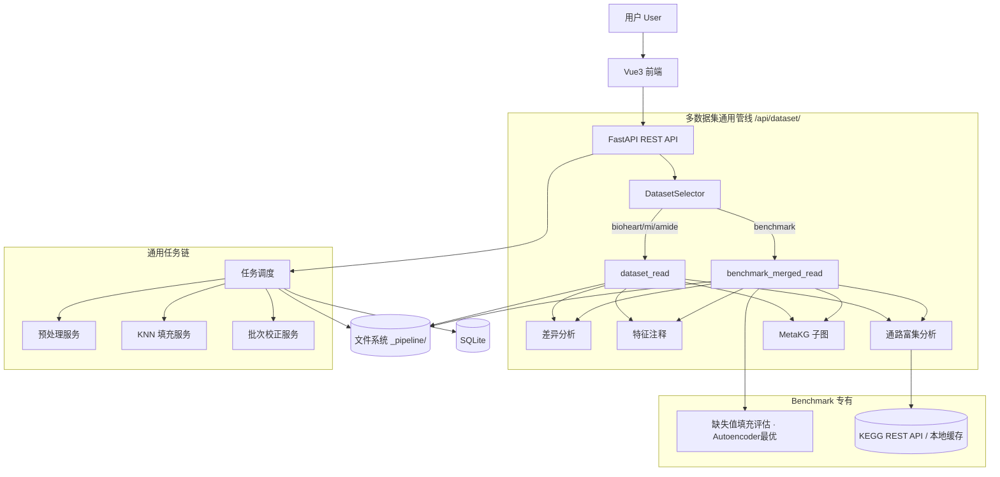

# 代谢组学数据处理系统架构（项目现状版）

> 面向代谢组学数据处理的 Web 系统架构与实现现状说明  
> **本文档以当前仓库真实代码为准，所有指标均来自真实数据运行结果（1715 样本 × 1180 特征 × 7 batches）。**  
> 最后更新：2026-04-21（多数据集切换展示已全面实现）

---

## 1. 项目目标

本系统是一个面向代谢组学数据处理的 Web 平台，核心能力包括：

- 多 sheet Excel 导入与跨 batch 合并（ionIdx 对齐）
- 数据预处理（标准化、对数变换、缺失率过滤）
- 缺失值填充方法对比评估（Mask-then-Impute 框架）
- 批次效应校正（baseline + strict ComBat 双方法）
- 多方法量化对比评估（Silhouette、batch centroid separation 等）
- 差异代谢物分析（t-test + BH-FDR + log2FC + 交互火山图）
- 特征注释（m/z 精确质量匹配 / 代谢物名精确匹配，HMDB / KEGG 数据库链接）
- **多数据集切换展示**（Benchmark / BioHeart / AMIDE / MI 四数据集）
- **KEGG 通路富集分析**（超几何检验 + BH-FDR，气泡图 + 力导向网络图）
- **MetaKG 知识图谱溯源**（整合 KEGG/HMDB/SMPDB，力导向交互图）
- 任务记录与结果管理

---

## 2. 技术栈

### 2.1 后端

| 组件 | 版本 / 说明 |
|------|------------|
| Python | 3.9（兼容性约束：`Optional[X]` 替代 `X \| None`） |
| FastAPI | REST API 框架 |
| Pydantic | 数据校验与序列化 |
| Uvicorn | ASGI 服务器 |
| SQLAlchemy + SQLite | ORM + 开发期数据库 |
| neuroCombat（pyComBat） | 经验 Bayes ComBat 批次校正（Johnson et al., 2007） |
| **PyTorch 2.8（CPU）** | **Autoencoder 深度学习填充（Masked Reconstruction，MIDA 策略）** |
| scikit-learn | KNN 填充、PCA、Silhouette 评估 |
| scipy | Welch t-test、统计检验 |
| statsmodels | BH-FDR 多重校正 |
| pandas / numpy | 数据矩阵操作 |
| matplotlib | 服务端 PCA 图生成（`matplotlib.use("Agg")`） |

### 2.2 前端

| 组件 | 版本 / 说明 |
|------|------------|
| Vue 3 + Vite | 单页应用框架 |
| TypeScript | 全量类型覆盖 |
| Vue Router | 5 个页面路由 |
| Pinia | 状态管理（benchmark store / task store） |
| Element Plus | UI 组件库 |
| ECharts | 火山图、通路富集气泡图/网络图、MetaKG 力导向图、PCA 解释方差柱图 |
| axios | HTTP 请求，统一代理 `/api → :8000` |
| SCSS | 全局样式变量 |

### 2.3 数据存储

- **SQLite**：任务表（tasks）、数据集表（datasets）、结果表（results）
- **本地文件系统**：上传原始文件、中间矩阵 CSV、评估产物 JSON / PNG

---

## 3. 系统分层架构

```
┌─────────────────────────────────────────────────────┐
│  表现层（Vue3 前端）                                   │
│  HomeView / ImportView / TaskConfigView /            │
│  ResultDashboardView / HistoryView                   │
└────────────────────┬────────────────────────────────┘
                     │ HTTP /api/*
┌────────────────────▼────────────────────────────────┐
│  接口层（FastAPI Routes）                              │
│  /api/tasks/* · /api/datasets/* · /api/upload        │
│  /api/benchmark/merged/*（20 个端点）                 │
│  /api/dataset/{dataset}/*（多数据集通用端点）          │
└────────────────────┬────────────────────────────────┘
                     │
┌────────────────────▼────────────────────────────────┐
│  业务服务层（app/services/）                           │
│  benchmark_merged_read · dataset_read                │
│  evaluation_service · differential_analysis_service  │
│  annotation_service · imputation_service             │
│  batch_correction_service · pathway_enrichment_service│
└────────────────────┬────────────────────────────────┘
                     │
┌────────────────────▼────────────────────────────────┐
│  算法分析层                                            │
│  neuroCombat · sklearn · scipy · statsmodels         │
└────────────────────┬────────────────────────────────┘
                     │
┌────────────────────▼────────────────────────────────┐
│  数据存储层                                            │
│  SQLite · data/processed/{dataset}/_pipeline/        │
└─────────────────────────────────────────────────────┘
```

---

## 4. 核心功能模块（实现状态）

### 4.1 数据导入与合并模块 ✅ 已实现

**职责**：解析多 sheet Excel（injections / intensities / ions / annotation），按 ionIdx 跨 batch 合并

**产物**：
- `benchmark_merged/merged_sample_by_feature.csv`（1715 × 1180，缺失率 0%）
- `merge_report.json`（样本数、特征数、merge 策略、batch 分布）
- `merged_sample_meta.csv`（样本元信息：batch_id / group_label / sample_type）

**关键参数**：7 batches，每 batch 245 样本，60 个 group_label（5 类物质 × 12 浓度梯度）

---

### 4.2 数据预处理模块 ✅ 已实现

**职责**：Z-score 标准化、log 变换、缺失率阈值过滤、样本过滤

**API**：`POST /api/tasks/{task_id}/preprocess`

---

### 4.3 缺失值填充评估模块 ✅ 已实现（含量化评估 + 深度学习）

**职责**：Mask-then-Impute 框架——随机遮蔽 15% 已知值，3 次重复，对 mean / median / KNN / **Autoencoder** 计算 RMSE / MAE / NRMSE

**Autoencoder 架构（PyTorch）**：

```
Input(1180) → Linear(256) → BatchNorm → Dropout(0.3)
            → Linear(64)  → ReLU
            → Linear(256) → BatchNorm
            → Linear(1180)
```

训练策略：**Masked Reconstruction Loss**——仅对已知（未遮蔽）位置计算 MSE，强迫模型从上下文特征重建缺失值。优化器：Adam + CosineAnnealingLR，200 epoch，batch_size=64。

参考文献：Gondara & Wang, "MIDA: Multiple Imputation using Denoising Autoencoders", PAKDD 2018

**关键结果（真实数据，1715 样本 × 1180 特征）**：

| 方法 | RMSE（均值） | RMSE（标准差） | 备注 |
|------|------------|--------------|------|
| **Autoencoder** | **0.2249** | **0.0035** | ✅ 最优，深度学习 |
| KNN（k=5） | 0.2980 | 0.0041 | 次优 |
| mean | 1.0011 | 0.0072 | — |
| median | 1.0361 | 0.0070 | — |

结论：Autoencoder（RMSE=0.2249）优于 KNN（0.2980），降幅 **24.5%**；KNN 较 mean 降幅 70%。Autoencoder 单次运行约 43 秒（CPU）。

**产物**：
- `imputation_eval/imputation_eval_report.json`（含 `best_method: "autoencoder"`，`ranking_by_rmse: ["autoencoder","knn","mean","median"]`）
- `imputation_eval/imputation_eval_feature.json`（per-feature RMSE）

---

### 4.4 批次效应校正模块 ✅ 双方法均已实现

#### baseline 批次校正（per-feature location-scale）

**方法**：对每个特征，各 batch 的均值中心化 + 标准差缩放对齐到全局参数

**产物**：
- `batch_corrected_sample_by_feature.csv`
- `batch_correction_method_report.json`
- `batch_correction_metrics.json`
- `pca_before_vs_after_batch_correction.png`

**关键指标（真实数据）**：

| 指标 | 校正前 | 校正后 |
|------|--------|--------|
| batch centroid separation (PC1-2) | 5.38 | **≈0（降幅 100%）** |
| silhouette(batch_id) | -0.146 | -0.034 |

#### strict ComBat（neuroCombat / pyComBat） ✅ 已实现

**方法**：经验 Bayes ComBat（Johnson et al., 2007），通过 neuroCombat 库实现

**关键指标（真实数据）**：

| 指标 | ComBat 后 |
|------|-----------|
| batch centroid separation | **≈0（1.9e-14）** |
| silhouette(batch_id) | -0.034 |

---

### 4.5 方法对比评估模块 ✅ 已实现（5 方法全量对比）

**职责**：对 5 种方法在 PC1-PC2 上计算 Silhouette、batch centroid separation，生成评估表与 PCA 对比图

**方法覆盖**：mean / median / knn（仅填充）、baseline / combat（填充 + 批次校正）

**关键结果（1715 样本 × 1180 特征）**：

| 方法 | silhouette(batch_id) | silhouette(group_label) | centroid sep |
|------|---------------------|------------------------|--------------|
| **baseline** | **-0.0343** | -0.4465 | **≈0** |
| **combat** | **-0.0343** | -0.4465 | **≈0** |
| knn | -0.1457 | -0.4818 | 5.40 |
| mean | -0.1455 | -0.4815 | 5.41 |
| median | -0.1450 | -0.4813 | 5.44 |

结论：baseline 与 ComBat 均完全消除 batch 效应（centroid sep ≈ 0）；未校正方法 batch 分离明显（~5.4）。

**产物**：
- `evaluation/evaluation_report.json`
- `evaluation/evaluation_table.csv`
- `evaluation/pca_before_vs_after.png`
- `evaluation/pca_{method}.json`（各方法 PCA 坐标）

---

### 4.6 差异代谢物分析模块 ✅ 已实现（全数据集支持）

**职责**：对任意两组样本执行独立双样本 Welch t-test，BH-FDR 多重校正，计算 log2 Fold Change，识别显著差异代谢物

**算法**：
- 独立双样本 Welch t-test（`scipy.stats.ttest_ind`，`equal_var=False`）
- BH-FDR 多重校正（`statsmodels.stats.multitest.multipletests`）
- log2FC = log2(mean_group1 / mean_group2)

**关键结果（Benchmark，P1_AA_0001 vs P1_AA_1024）**：
- 总特征：1180 个
- 显著特征（|log2FC|≥1，q-value≤0.05）：**538 个**（上调 226 个，下调 312 个）

**数据集支持**：Benchmark / BioHeart / AMIDE / MI 全部支持，前端 `VolcanoPlotCard` 通过 `dataset` prop 切换 API。

**缓存机制**：结果写入 `diff_analysis/diff_{g1}_vs_{g2}.json`，再次请求直接读缓存

---

### 4.7 特征注释模块 ✅ 已实现（Benchmark 100% 覆盖，BioHeart/MI 名称匹配）

#### Benchmark（m/z 精确质量匹配）

**职责**：从各 batch 的 annotation sheet 中，按 |mz delta| 最小取最优候选，将 1180 个代谢特征全覆盖映射到代谢物名称、分子式、HMDB ID、KEGG ID

| 指标 | 数值 |
|------|------|
| 总特征数 | 1180 |
| 注释覆盖率 | **100%（1180/1180）** |
| 含 HMDB ID | 1180 |
| 含 KEGG ID | 577 |

#### BioHeart / MI（代谢物名称精确匹配）

**职责**：基于 HMDB `hmdb_metabolites.json`，对代谢物名做精确匹配与自定义别名补全，映射 HMDB ID 与 KEGG Compound ID

| 数据集 | 特征数 | 注释成功 | KEGG 覆盖 | 覆盖率 |
|--------|--------|---------|-----------|--------|
| BioHeart | 53 | 49 | 45 | 92.5% |
| MI | 14 | 13 | 9 | 92.9% |

**脚本**：`backend/scripts/build_named_dataset_annotation.py`

**产物**：`_pipeline/annotated_feature_meta.json`（各数据集独立）

---

### 4.8 任务记录与结果管理模块 ✅ 已实现

**职责**：SQLite 记录每次任务的参数与状态，支持历史任务查询

**表结构**：tasks / datasets / configs / results

---

### 4.9 通路富集分析模块 ✅ 已实现（Benchmark / BioHeart / MI 支持）

**职责**：对差异显著代谢物（label ∈ {up, down}）的 KEGG Compound ID，以全体含注释特征为背景，执行超几何检验，筛选统计显著富集的 KEGG 代谢通路

**算法**：超几何检验（等价 Fisher's exact test，单侧）+ BH-FDR 多重校正

**KEGG 数据获取**：
- 化合物-通路映射：`GET https://rest.kegg.jp/link/pathway/compound`（仅保留 `map` 前缀 reference pathway）
- 通路名称：`GET https://rest.kegg.jp/list/pathway`
- 两者均在首次调用后写入 `_pipeline/kegg_cache/`，后续从本地缓存读取

**关键结果（Benchmark，P1_AA_0001 vs P1_AA_1024，FC≥1, FDR≤0.05）**：

| 通路 ID | 通路名称 | Hits | 通路大小 | RichFactor | q-value |
|---------|----------|------|----------|------------|---------|
| **map00470** | D-Amino acid metabolism | **30** | 31 | **0.968** | **0.0002** |
| map00310 | Lysine degradation | 16 | 17 | 0.941 | 0.149 |
| map01060 | Biosynthesis of plant secondary metabolites | 35 | 44 | 0.796 | 0.156 |

**数据集支持**：Benchmark / BioHeart / MI（AMIDE 因匿名特征不支持）

**前端**：
- 气泡图（Y=通路名，X=RichFactor，点大小=hits，颜色=-log10(q)，仿 clusterProfiler 风格）
- 力导向网络图（蓝色=显著代谢物，橙色=KEGG 通路，可拖拽缩放）
- 明细表（点击通路名可跳转 KEGG 网页）

---

### 4.10 知识图谱溯源模块 ✅ 已实现（Benchmark / BioHeart / MI 支持）

**职责**：基于 MetaKG 多库整合知识图谱（KEGG / SMPDB / HMDB），以力导向网络图展示本项目代谢物与通路、生化反应、酶、药物等实体的一跳关系网络

**数据来源**：
- 原始文件：`metakg_entities.csv`（500 MB）+ `metakg_triples.csv`（2.2 GB）
- 预处理工具：`backend/scripts/build_metakg_subgraph_dataset.py`（支持 `--dataset` 参数）
- 输出子图：`_pipeline/metakg_subgraph.json`（各数据集独立）

**各数据集子图规模**：

| 数据集 | 种子代谢物 | 总节点 | 总边 | 文件大小 |
|--------|-----------|--------|------|---------|
| Benchmark | 977 | 7,866 | 14,173 | 2.6 MB |
| BioHeart | 49 | 6,498 | 11,927 | 2.14 MB |
| MI | 13 | 268 | 825 | 0.13 MB |

**数据集支持**：Benchmark / BioHeart / MI（AMIDE 因匿名特征不支持）

**前端**：力导向网络图 + 节点类型/关系类型过滤 + 搜索高亮 + 种子专属模式 + 最大节点数滑块

---

### 4.11 多数据集切换展示 ✅ 已实现

**职责**：结果仪表盘支持 Benchmark / BioHeart / AMIDE / MI 四数据集切换，页面所有区块根据选中数据集实时切换数据源

**实现方式**：
- `DatasetSelector` 组件 + `selectedDataset` 响应式变量
- 后端 `/api/dataset/{dataset}/*` 通用路由（代替旧有 benchmark 专用路由）
- 各组件通过 `dataset` prop 切换 API 调用

**各数据集功能支持矩阵**：

| 功能模块 | Benchmark | BioHeart | MI | AMIDE |
|---|:---:|:---:|:---:|:---:|
| KPI / PCA / 指标 / 方法对比 | ✅ | ✅ | ✅ | ✅ |
| 差异代谢物火山图 | ✅ | ✅ | ✅ | ✅ |
| 特征注释表 | ✅ | ✅ | ✅ | ❌ |
| 通路富集分析 | ✅ | ✅ | ✅ | ❌ |
| MetaKG 知识图谱 | ✅ | ✅ | ✅ | ❌ |
| 缺失值填充评估 | ✅ | ❌ | ❌ | ❌ |

> AMIDE 有 6461 个匿名质谱特征，无代谢物名称，无法进行注释/富集/MetaKG 分析。

---

## 5. 核心数据流

```
多 sheet Excel（7 batches）
        │
        ▼
   跨 batch 合并（ionIdx 对齐）
   1715 样本 × 1180 特征，缺失率 0%
        │
        ├─── Mask-then-Impute 评估（4 方法）
        │    Autoencoder RMSE=0.225 ✓ / KNN RMSE=0.298 / mean=1.00 / median=1.04
        │
        ▼
   KNN 填充后矩阵
        │
        ├── baseline 校正 → centroid_sep: 5.38 → ≈0 ✓
        ├── ComBat 校正   → centroid_sep: 5.38 → ≈0 ✓
        └── 5 方法对比评估（evaluation_table.csv）
                │
                ├── 特征注释（m/z 匹配，1180/1180，100% 覆盖）
                │         └── 产出 annotated_feature_meta.json
                │                  含 577 个 KEGG Compound ID
                │
                ├── 差异代谢物分析（任意两组，538 个显著特征）
                │         └── 注入代谢物名 + HMDB/KEGG 链接
                │                  ↓
                │         通路富集分析（超几何检验 + BH-FDR）
                │         ├── 背景：577 含 KEGG ID 特征
                │         ├── 检验：254 条 KEGG reference pathway
                │         └── FDR<0.05：3 条显著通路（map00470 q=0.0002）
                │
                └── 结果缓存至 _pipeline/ 各子目录

BioHeart / MI（独立数据集管线）
        │
        ├── 代谢物名精确匹配（HMDB 数据库）→ annotated_feature_meta.json
        ├── MetaKG 子图提取 → metakg_subgraph.json
        ├── baseline 批次校正 + 方法对比评估
        └── 差异分析 + 通路富集 + MetaKG 可视化
```

---

## 6. 系统架构图



---

## 7. 前端页面结构

| 路由 | 页面 | 主要功能 |
|------|------|---------|
| `/` | HomeView | 技术亮点（9 张卡）、系统流程（5 步）、快捷入口 |
| `/import` | ImportView | 文件上传、sheet 校验、task_id 获取 |
| `/config` | TaskConfigView | 预处理/填充/批次参数配置，6 步进度条 |
| `/result` | ResultDashboardView | **数据集选择器** + KPI + PCA + 指标 + 填充评估（benchmark）+ 差异分析火山图 + 通路富集分析 + MetaKG 知识图谱 + 特征注释 + 方法对比 + 文件下载 |
| `/history` | HistoryView | 历史任务列表 |

### ResultDashboardView 区块结构

```
数据集选择器（Benchmark / BioHeart / AMIDE / MI）
  ↓
KPI（样本数 / 特征数 / batch 数 / 缺失率）
  ↓
PCA 四宫格图 + 解释方差柱图
  ↓
batch_correction_metrics（before/after 指标对比卡）
  ↓
结果解释段（引用 JSON 数值自动生成）
  ↓
缺失值填充评估（仅 Benchmark：Mask-then-Impute RMSE 对比，Autoencoder 最优）
  ↓
差异代谢物分析（组选择 + 交互火山图 + 显著特征表）【全数据集】
  ↓
通路富集分析（气泡图 + 力导向网络图 + 明细表）【Benchmark/BioHeart/MI】
  ↓
MetaKG 知识图谱溯源（力导向图 + 过滤 + 搜索）【Benchmark/BioHeart/MI】
  ↓
特征注释（统计条 + 分页表格 + 关键词搜索）【Benchmark/BioHeart/MI】
  ↓
方法对比实验（evaluation_table.csv + PCA 对比图 + 单方法 PCA JSON）
  ↓
文件下载（baseline 产物 + evaluation 产物）
```

---

## 8. 实际目录结构（关键文件）

### 后端

```text
backend/
├── app/
│   ├── main.py
│   ├── core/config.py
│   ├── api/routes/
│   │   ├── benchmark_merged.py     # /api/benchmark/merged/* (20 个端点)
│   │   ├── dataset.py              # /api/dataset/{dataset}/* 多数据集通用路由
│   │   ├── tasks.py
│   │   ├── upload.py
│   │   └── ...
│   ├── services/
│   │   ├── benchmark_merged_read.py      # Benchmark 只读数据聚合层
│   │   ├── dataset_read.py               # 多数据集只读聚合层
│   │   ├── evaluation_service.py         # PCA + Silhouette + centroid 评估
│   │   ├── differential_analysis_service.py  # t-test + BH-FDR + log2FC（支持所有数据集）
│   │   ├── annotation_service.py         # m/z 精确质量匹配注释（Benchmark）
│   │   ├── imputation_service.py         # mean/median/KNN/Autoencoder + Mask-then-Impute
│   │   ├── batch_correction_service.py   # baseline + ComBat
│   │   └── pathway_enrichment_service.py # 超几何检验 + BH-FDR + KEGG缓存（含多数据集函数）
│   └── ...
├── scripts/
│   ├── build_dataset_pipeline.py         # 为非 benchmark 数据集生成 _pipeline/ 产物
│   ├── build_named_dataset_annotation.py # 代谢物名 → HMDB/KEGG 映射（bioheart/mi）
│   └── build_metakg_subgraph_dataset.py  # MetaKG 子图提取（支持 --dataset 参数）
└── data/processed/
    ├── benchmark_merged/                 # Benchmark 数据集
    │   ├── _pipeline/                    # 含 imputation_eval/（benchmark 专有）
    │   └── ...
    ├── bioheart/
    │   └── _pipeline/                    # annotated_feature_meta.json / metakg_subgraph.json
    ├── mi/
    │   └── _pipeline/
    └── amide/
        └── _pipeline/
```

### 前端

```text
frontend/src/
├── api/
│   ├── benchmark.ts    # fetchDiffGroups, fetchPathwayEnrichment, fetchMetakgSubgraph 等
│   ├── dataset.ts      # fetchDatasetDiff*, fetchDatasetAnnotation*, fetchDatasetPathwayEnrichment,
│   │                   # fetchDatasetMetakgSubgraph 等（多数据集通用）
│   ├── task.ts
│   └── upload.ts
├── components/
│   ├── DatasetSelector.vue             # 数据集切换选择器
│   ├── AnnotationTableCard.vue         # 特征注释分页表格（含 dataset prop）
│   ├── VolcanoPlotCard.vue             # 交互火山图（含 dataset prop）
│   ├── PathwayEnrichmentCard.vue       # 通路富集气泡图+网络图（含 dataset prop）
│   ├── MetaKGCard.vue                  # MetaKG 知识图谱（含 dataset prop）
│   ├── ImputationEvalCard.vue          # 填充评估 RMSE 对比（Benchmark 专用）
│   ├── PipelineStepBar.vue             # 6 步进度条
│   ├── MetricCompareCard.vue           # before/after 指标卡
│   ├── KpiCard.vue
│   ├── MethodStatusCard.vue
│   ├── PcaImagePanel.vue
│   ├── EvRatioChart.vue
│   └── DownloadFileCard.vue
├── stores/
│   ├── benchmark.ts    # Pinia 状态管理（benchmark 数据缓存）
│   └── task.ts
├── types/
│   ├── benchmark.ts    # DiffFeature / AnnotatedFeature / PathwayItem / MetaKGNode 等
│   └── task.ts
├── views/
│   ├── HomeView.vue
│   ├── ResultDashboardView.vue   # 核心：数据集切换 + 所有区块
│   ├── TaskConfigView.vue
│   ├── ImportView.vue
│   └── HistoryView.vue
└── utils/format.ts
```

---

## 9. 已实现 API 端点清单

### 通用任务链

| 方法 | 路径 | 说明 |
|------|------|------|
| POST | `/api/upload` | 文件上传，返回 task_id |
| GET | `/api/datasets/{id}/preview` | 数据预览 |
| POST | `/api/tasks` | 创建/保存任务配置 |
| POST | `/api/tasks/{id}/preprocess` | 执行预处理 |
| POST | `/api/tasks/{id}/impute` | 执行填充 |
| POST | `/api/tasks/{id}/batch-correct` | 执行批次校正 |
| GET | `/api/tasks/{id}/evaluation` | 获取评估结果 |
| GET | `/api/tasks` | 历史任务列表 |

### Benchmark Merged 专用（答辩演示主链路）

| 方法 | 路径 | 说明 |
|------|------|------|
| GET | `/api/benchmark/merged/summary` | 合并摘要 |
| GET | `/api/benchmark/merged/batch-correction/report` | 方法报告 |
| GET | `/api/benchmark/merged/batch-correction/metrics` | 校正前后指标 |
| GET | `/api/benchmark/merged/pca-after` | 校正后 PCA 数据 |
| GET | `/api/benchmark/merged/assets/pca_before_vs_after.png` | PCA 四宫格图 |
| GET | `/api/benchmark/merged/files` | 可下载文件列表 |
| GET | `/api/benchmark/merged/download/{filename}` | 文件下载 |
| GET | `/api/benchmark/merged/evaluation/summary` | 方法对比摘要 |
| GET | `/api/benchmark/merged/evaluation/table` | 方法对比表 |
| GET | `/api/benchmark/merged/evaluation/pca-image` | PCA 对比图 |
| GET | `/api/benchmark/merged/evaluation/pca/{method}` | 单方法 PCA 坐标 |
| GET | `/api/benchmark/merged/evaluation/files` | evaluation 产物下载列表 |
| GET | `/api/benchmark/merged/evaluation/download/{file}` | evaluation 文件下载 |
| GET | `/api/benchmark/merged/imputation-eval/summary` | 填充评估摘要 |
| GET | `/api/benchmark/merged/imputation-eval/feature-rmse` | per-feature RMSE |
| GET | `/api/benchmark/merged/annotation/summary` | 注释汇总统计 |
| GET | `/api/benchmark/merged/annotation/features` | 分页注释特征列表 |
| GET | `/api/benchmark/merged/diff-analysis/groups` | 可用分组列表（60 组） |
| POST | `/api/benchmark/merged/diff-analysis/run` | 运行/缓存读取差异分析 |
| GET | `/api/benchmark/merged/pathway-enrichment` | KEGG 通路富集分析 |
| GET | `/api/benchmark/merged/metakg-subgraph` | MetaKG 知识图谱子图 |

### 多数据集通用路由（新增）

| 方法 | 路径 | 支持数据集 | 说明 |
|------|------|-----------|------|
| GET | `/api/dataset/list` | 全部 | 数据集列表及可用状态 |
| GET | `/api/dataset/{dataset}/summary` | 全部 | 数据摘要 |
| GET | `/api/dataset/{dataset}/batch-correction/metrics` | 全部 | 批次校正指标 |
| GET | `/api/dataset/{dataset}/batch-correction/pca-after` | 全部 | 校正后 PCA |
| GET | `/api/dataset/{dataset}/assets/pca_before_vs_after.png` | 全部 | PCA 图 |
| GET | `/api/dataset/{dataset}/evaluation/summary` | 全部 | 方法对比摘要 |
| GET | `/api/dataset/{dataset}/evaluation/table` | 全部 | 方法对比表 |
| GET | `/api/dataset/{dataset}/evaluation/pca-image` | 全部 | PCA 对比图 |
| GET | `/api/dataset/{dataset}/evaluation/pca/{method}` | 全部 | 单方法 PCA |
| GET | `/api/dataset/{dataset}/diff-analysis/groups` | 全部 | 可用分组 |
| GET | `/api/dataset/{dataset}/diff-analysis/run` | 全部 | 差异分析 |
| GET | `/api/dataset/{dataset}/annotation/summary` | benchmark/bioheart/mi | 注释汇总 |
| GET | `/api/dataset/{dataset}/annotation/features` | benchmark/bioheart/mi | 分页注释列表 |
| GET | `/api/dataset/{dataset}/pathway-enrichment` | benchmark/bioheart/mi | 通路富集分析 |
| GET | `/api/dataset/{dataset}/metakg-subgraph` | benchmark/bioheart/mi | MetaKG 子图 |
| GET | `/api/dataset/{dataset}/download/{filename}` | 全部 | 产物文件下载 |

---

## 10. 运行方式

### 后端启动

```bash
cd backend
pip install -r requirements.txt   # 包含 neuroCombat / pyComBat
uvicorn app.main:app --reload --port 8000
```

### 前端启动

```bash
cd frontend
npm install
npm run dev
# Vite 代理：/api → http://127.0.0.1:8000
```

### 重新运行 benchmark 管线（如需重建产物）

```bash
cd backend
PYTHONPATH=. python3 app/scripts/run_merged_benchmark_pipeline.py
# 可选参数：--skip-imputation-eval --skip-evaluation
```

### 为非 benchmark 数据集生成产物

```bash
cd backend

# 1. 生成基础 pipeline 产物（批次校正/PCA/评估）
PYTHONPATH=. python3 scripts/build_dataset_pipeline.py --dataset bioheart
PYTHONPATH=. python3 scripts/build_dataset_pipeline.py --dataset mi

# 2. 生成特征注释
PYTHONPATH=. python3 scripts/build_named_dataset_annotation.py --dataset bioheart
PYTHONPATH=. python3 scripts/build_named_dataset_annotation.py --dataset mi

# 3. 生成 MetaKG 子图
PYTHONPATH=. python3 scripts/build_metakg_subgraph_dataset.py --dataset bioheart
PYTHONPATH=. python3 scripts/build_metakg_subgraph_dataset.py --dataset mi
```

---

## 11. 实施进度总结

| 阶段 | 内容 | 状态 |
|------|------|------|
| 阶段一 | Vue3 前端多页面 + merged 结果页 | ✅ 完成 |
| 阶段二 | baseline 批次校正 + 量化评估 | ✅ 完成 |
| 阶段三 | strict ComBat（neuroCombat）+ 5 方法对比 | ✅ 完成 |
| 阶段四 | KNN 填充 Mask-then-Impute 评估 | ✅ 完成 |
| 阶段五 | 差异代谢物分析（t-test + BH-FDR + 火山图） | ✅ 完成 |
| 阶段六 | 特征注释（m/z 匹配，100% 覆盖，HMDB/KEGG） | ✅ 完成 |
| **阶段七** | **Autoencoder 深度学习填充（PyTorch，RMSE=0.2249，最优）** | ✅ **完成** |
| **阶段八** | **KEGG 通路富集分析（超几何检验+BH-FDR，气泡图+网络图）** | ✅ **完成** |
| **阶段九** | **MetaKG 知识图谱溯源（7866节点/14173边，力导向图+搜索+过滤）** | ✅ **完成** |
| **阶段十** | **多数据集切换展示（Benchmark/BioHeart/MI/AMIDE 四数据集）** | ✅ **完成** |

---

## 12. 架构设计结论

本系统是典型的"算法驱动型代谢组学 Web 平台"：

- **前端**（Vue3）：负责交互、可视化展示与用户操作，通过 `dataset` prop 实现多数据集组件复用
- **FastAPI**：负责 REST 接口与流程编排，Python 3.9 兼容；多数据集路由通过 `/{dataset}/` 动态参数统一管理
- **Python 算法模块**：neuroCombat / sklearn / scipy / statsmodels / **PyTorch** 驱动核心分析
- **文件系统**：`data/processed/{dataset}/_pipeline/` 作为各数据集产物仓库，格式统一
- **SQLite**：负责任务记录与参数持久化

核心设计原则：**所有展示指标均来自真实数据运行，不手填。**
